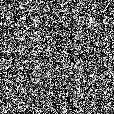

# DDPM 论文复现（Jittor 实现）

## 论文名称

> **Denoising Diffusion Probabilistic Models**  
> NeurIPS 2020 · [原论文链接](https://papers.nips.cc/paper_files/paper/2020/file/4c5bcfec8584af0d967f1ab10179ca4b-Paper.pdf)

---

## 一、项目简介

本项目基于 Jittor 框架复现 DDPM 模型。包括：

- 使用 MNIST 数据集进行训练与采样
- 与 PyTorch 实现对齐的训练、测试流程
- 包含训练日志、性能日志、loss 曲线、FID 和 IS 等评估指标

---

## 二、环境配置

### 创建虚拟环境并安装 Jittor

```bash
# 创建 conda 虚拟环境
conda create -n jittor python=3.8
conda activate jittor

# 安装 Jittor
conda install pywin32
pip install jittor==1.3.5.25	#我用的版本

# 测试安装是否成功
python -m jittor.test.test_core
python -m jittor.test.test_example
python -m jittor.test.test_cudnn_op
```

> 更多详细说明见 Jittor 官网：https://github.com/Jittor/jittor


### 已安装相关依赖

```text
jittor==1.3.5.25
numpy==1.24.4
pillow==10.4.0
matplotlib==3.7.5
tqdm==4.67.1
```

---

## 三、目录结构说明

```
Jittor 项目结构                          |   PyTorch 项目结构
-------------------------------------- | -----------------------------------------------
DDPM-main2/                            |   Pytorch-DDPM-main/
└── DiffusionModels/                   |   └── DiffusionModels/
    ├── checkpoints/                   |       ├── checkpoints/			# 保存模型权重文件
    ├── data/                          |       ├── data/				# 数据集（预处理后的 .npz）
    ├── fid/                           |       ├── fid/					# 存储采样图像用于FID评估
    ├── logs/                          |       ├── logs/				# 保存loss曲线与性能日志
    ├── samples/                       |       ├── samples/				# 采样结果及 sample_grid.png
    ├── ddpm_mnist.ckpt                |       ├── ddpm_mnist.pth		# MNIST训练模型
    ├── ddpm_my_dataset.ckpt           |       ├── ddpm_my_dataset.ckpt	# 自定义数据集模型
    ├── model.py                       |       ├── model.py				# UNet模型定义
    ├── prepare_data.py                |       ├── prepare_data.py		# 数据集处理脚本
    ├── sample.py                      |       ├── sample.py			# 批量采样脚本（支持设置seed与批处理）
    ├── train.py                       |       ├── train.py				# 训练脚本（保存训练日志与loss曲线）
                                       |       ├── calc_fid.py			# FID 评估脚本（版本一）
                                       |       ├── calc_is.py			# IS 评估脚本（版本一）
                                       |       ├── fid_score.txt		# FID 评估结果输出
                                       |       ├── is_score.txt			# IS 评估结果输出
```

---


## 四、数据准备

项目提供 `prepare_data.py` 脚本用于数据预处理，支持内置数据集（如 MNIST、CIFAR10）和自定义图像文件夹结构的数据。

### 脚本说明

`prepare_data.py` 脚本包含两种数据预处理模式：

- **内置数据集**：支持 `mnist` 和 `cifar10`，会自动下载并转换为 `.npz` 格式。
- **自定义图像文件夹**：假设图像按类别名分在不同子文件夹中，图像会自动 resize、标准化并转换为 `.npz`。

### 使用方法

#### 1. 内置数据集（如 MNIST、CIFAR10）

```bash
# 预处理 MNIST 并保存为 .npz 格式
python prepare_data.py --dataset mnist

# 预处理 CIFAR10
python prepare_data.py --dataset cifar10
```

输出文件默认保存到 `data/{dataset}_processed.npz`。

#### 2. 自定义数据集（按类名分文件夹）

要求图像文件夹结构如下：

```
data/my_dataset/
├── class1/
│   ├── img001.jpg
│   └── ...
├── class2/
│   ├── img101.png
│   └── ...
```

执行命令：

```bash
python prepare_data.py --dataset data/my_dataset
```

也可指定自定义保存路径：

```bash
python prepare_data.py --dataset data/my_dataset --out data/my_dataset_processed.npz
```

### 输出格式

脚本最终生成 `.npz` 压缩文件，包含以下两个字段：

- `images`: 图像数据，shape 为 `(N, C, H, W)`，数据范围为 `[-1, 1]`
- `labels`: 类别索引，shape 为 `(N,)`


## 五、训练与采样

### Jittor 训练

`train_jittor.py` 脚本用于在 Jittor 框架下训练 DDPM 模型，支持自定义数据集和参数设定。该脚本支持完整日志记录、保存每轮模型权重及绘制 loss 曲线图像。

```bash
python train_jittor.py --dataset mnist --epochs 40 --batch_size 128 --lr 1e-4 --T 1000
```

支持参数说明：

- `--dataset`：数据集名（如 mnist 或对应 .npz 文件前缀）
- `--epochs`：训练轮数
- `--batch_size`：每轮 batch 数量
- `--image_channels`：图像通道数，若未指定则自动根据数据集推断（mnist 为 1，cifar10 为 3）
- `--lr`：学习率（默认 1e-4）
- `--T`：扩散步数（默认 1000）
- `--seed`：随机种子

运行结果包括：

- 训练日志（logs/train_log.txt）
- 性能记录（logs/performance_log.txt）
- loss 曲线图（logs/loss_curve_{dataset}.png）
- 每轮模型权重保存（checkpoints/ddpm_{dataset}_epoch{n}.ckpt）

### Jittor 采样

`sample_jittor.py` 脚本用于从训练好的 DDPM 模型中采样生成图像，支持批量采样、step 可视化保存、FID 评估图像导出和网格图生成。

```bash
python sample_jittor.py --ckpt checkpoints/ddpm_mnist_epoch40.ckpt --num_samples 10000
```

支持参数说明：

- `--ckpt`：模型权重路径（必需）
- `--num_samples`：采样图像总数（默认 10000）
- `--batch_size`：每轮最大采样数量（默认 64）
- `--image_channels`：图像通道数（默认 1，MNIST 用 1，CIFAR10 用 3）
- `--size`：输出图像尺寸（默认 28x28）
- `--seed`：随机种子（默认 42）

运行结果包括：

- 分批保存的图像样本（fid/sample_*.png）
- 采样 step 可视化图（samples/step_tXXXX.png）
- 图像网格图（samples/sample_grid.png）
- 性能记录日志（logs/performance_log2.txt）

---

## 六、评估指标

### FID 评估

为衡量生成图像的质量，我提供 `calc_fid.py` 脚本用于计算 Frechet Inception Distance（FID）分数。

```bash
python calc_fid.py --real data/mnist_processed.npz --fake fid --out fid_score.txt
```

#### 参数说明：

- `--real`：真实图像数据（经过预处理的 `.npz` 文件）
- `--fake`：生成图像所在目录（PNG 格式）
- `--out`：FID 结果输出路径（默认写入 `fid_score.txt`）
- `--batch_size`：每轮处理图像数（默认 64）

#### 实现说明：

- 真实图像从 `.npz` 文件中加载，并插值至 299×299 尺寸（重复通道变为 RGB）。
- 生成图像按文件名排序，统一转换并处理。
- 使用 `torchmetrics.image.FrechetInceptionDistance` 进行双向统计并计算最终分数。

输出结果将以文本形式保存至指定文件，例如：

文件内容（fid_score.txt）：

```
FID score: 12.3456
```

FID 越低，表示生成图像与真实图像分布越接近。


### Inception Score (IS) 评估

除了 FID，我还提供 `calc_is.py` 脚本用于计算生成图像的 Inception Score（IS）指标。

```bash
python calc_is.py --folder fid --out inception_score.txt
```

#### 参数说明：

- `--folder`：包含生成图像的文件夹路径（PNG/JPG 图像）
- `--batch_size`：加载批大小（默认 32）
- `--splits`：分片数量，用于估计方差（默认 10）
- `--out`：输出评分保存路径（默认为 `inception_score.txt`）

#### 实现细节：

- 图像输入使用 torchvision 的 `inception_v3` 预训练模型处理；
- 所有图像会被调整为 299×299 大小，并归一化；
- 模型输出经过 softmax 后按 split 分组，计算 KL 散度并求平均；
- 最终结果以 `Inception Score: mean ± std` 格式输出并写入文本文件：

输出示例：

```
Inception Score: 9.8732 ± 0.3421
```

Inception Score 越高，表示生成图像更加清晰且多样性较好。

---

## 七、对齐验证

### 训练与采样耗时对比分析

我们统计了 PyTorch 与 Jittor 框架在相同模型配置下**训练** 40 个 epoch 的总耗时差异，并绘制如下图表：


- **PyTorch** 平均每轮训练耗时约为 **50.06 秒**；
- **Jittor** 平均每轮训练耗时约为 **76.83 秒**；
- PyTorch 整体训练过程更为稳定，Jittor 在部分轮次中存在明显波动，尤其集中于中段阶段。

该对比反映出在未开启特殊加速选项的情况下，两种框架在性能优化层面表现不同，PyTorch 在稳定性和执行效率上略优，但两者均能完成训练任务并正常收敛。

**详细数据如下：**

- [performance_log_jittor.txt](Pytorch-DDPM-main/DiffusionModels/logs/performance_log_jittor.txt)  
- [performance_log_pytorch.txt](Pytorch-DDPM-main/DiffusionModels/logs/performance_log_pytorch.txt)

在**采样** 10,000 张图像的性能评估中：

- **PyTorch** 版本总耗时为 **1 小时 20 分 34 秒**；
- **Jittor** 版本总耗时为 **1 小时 16 分 3 秒**。

尽管两个框架底层实现差异明显，但在本项目中二者采样效率相当，Jittor 稍快约 4 分钟，表明其在采样环节拥有良好表现。

### Loss 分阶段对比分析

为更细致地观察 PyTorch 与 Jittor 在训练过程中的表现，我们将完整的 Loss 曲线划分为 **前段 / 中段 / 后段**，并分别取各阶段代表性的 **200 步**进行可视化对比。

| 训练阶段 | Loss 对比图（PyTorch：蓝色，Jittor：橙色）       |
| -------- | ------------------------------------------------ |
| 前段     |  |
| 中段     |  |
| 后段     |  |

- **前段阶段**：两者在初始阶段都迅速下降，整体收敛趋势一致，jittor下降更快，较优；
- **中段阶段**：两者相差不多；
- **后段阶段**：两者最终收敛表现接近，PyTorch Loss 均值略低，较优。

**详细数据如下：**

- [performance_log_jittor.txt](Pytorch-DDPM-main/DiffusionModels/logs/train_log_jittor.txt)  
- [performance_log_pytorch.txt](Pytorch-DDPM-main/DiffusionModels/logs/train_log_pytorch.txt)

### 评估指标结果汇总

| 框架    | FID 分数 | Inception Score (IS) |
| ------- | -------- | -------------------- |
| PyTorch | 10.8811  | 2.3545 ± 1.0173      |
| Jittor  | 10.0643  | 2.2776 ± 1.0254      |

- **FID 分数**越低越好：Jittor 的结果略优于 PyTorch，表明其生成图像在整体分布上与真实图像更接近。
- **IS 分数**越高越好：PyTorch 得分略高，表明其在图像清晰度与多样性方面略优。

## 八、生成样本展示

以下为分别在 **MNIST**（灰度）和 **CIFAR10**（彩色）数据集上训练后生成的样本图像：

## MNIST 样本

<div align="center">
  
</div>

### MNIST 渐进式采样展示

<div align="center">
  
  
  
  
  
  
  
  
  
  
  
</div>
## CIFAR10 样本

<div align="center">
  
</div>
### CIFAR10 渐进式采样展示

<div align="center">
  
  
  
  
  
  
  
  
  
  
  
</div>